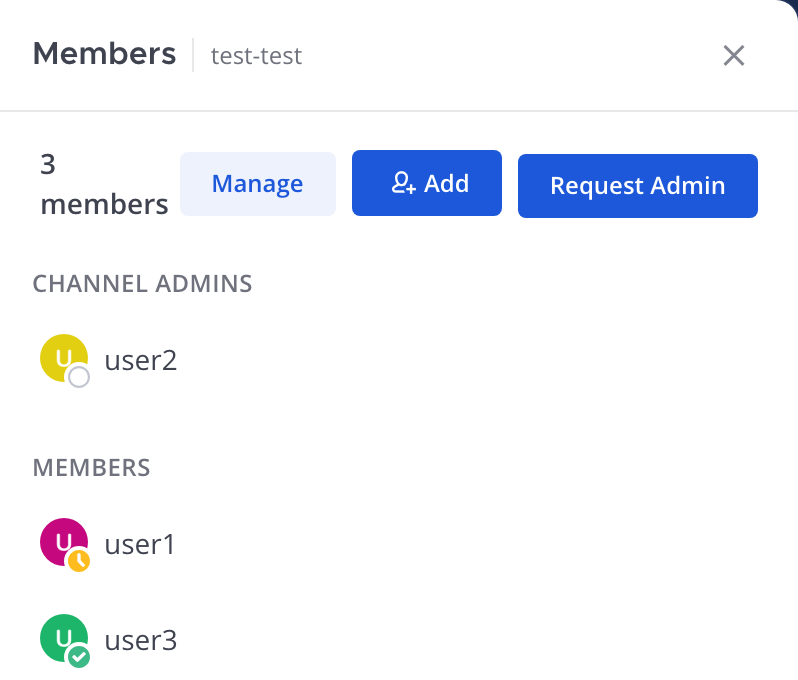
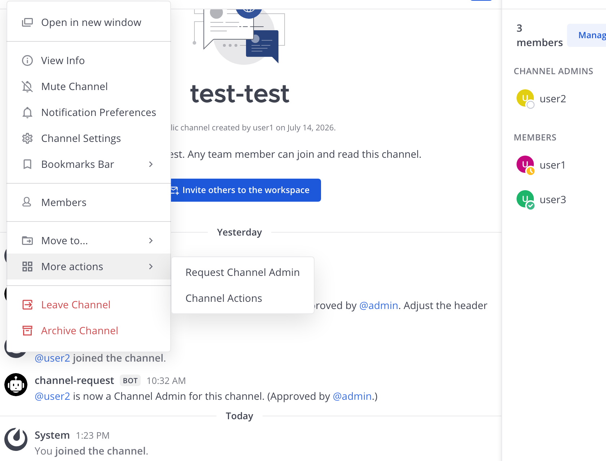
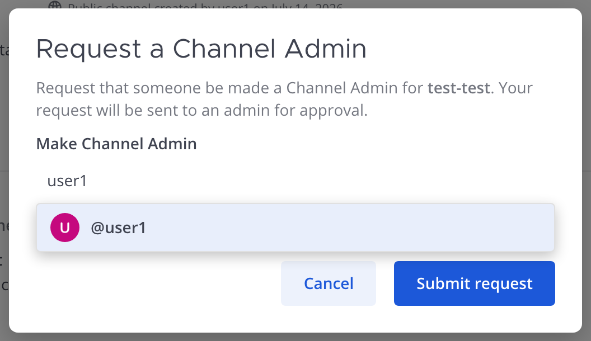
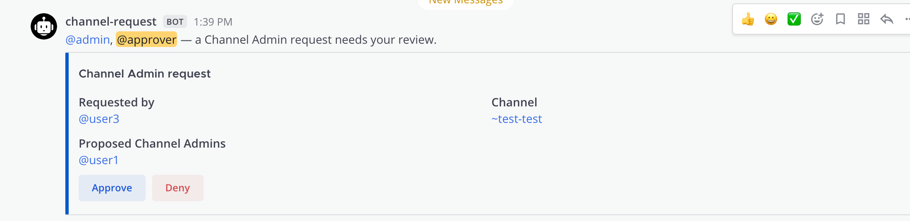

# Channel Admin Requests — User Guide

The Channel Requests plugin also lets a member **request that someone be made a
Channel Admin** on a channel that already exists — without giving every member
the ability to manage the channel directly. The request goes to an approver;
on approval the nominee is added to the channel (if not already a member) and
granted the Channel Admin role.

> This is the companion to [creating channels](CHANNEL_CREATION_GUIDE.md). *That* guide is
> about requesting a **new** channel; *this* one is about requesting **admin
> rights on an existing** channel.

This guide covers three roles:

- [Requesting a Channel Admin](#requesting-a-channel-admin) — any non-admin member
- [Approving requests](#approving-requests) — approvers
- [Admin setup](#admin-setup) — system admins

---

## Requesting a Channel Admin

There are two ways to open the request form, and both open the same window. The
option is **only shown to members who aren't already an admin** of the channel —
if you're already a Channel Admin (or a System Admin), you can manage the channel
directly and won't see it.

### 1. From the Members panel

Open the channel's **Members** list (click the member count in the channel
header). Next to **Add** you'll see a **Request Admin** button.

### 2. From the channel-name menu

Click the channel name at the top-left, then **More actions → Request Channel
Admin**. (Same form as the Members-panel button — use whichever is handier.)

### Filling out the request

| Field | What it does |
|-------|--------------|
| **Make Channel Admin** | Search and add one or more people to be promoted to Channel Admin. Start typing a name and pick from the list. |

Everyone you add is promoted to Channel Admin once an approver accepts the
request. Anyone who isn't already in the channel is added to it first.

Click **Submit request**. You'll see a confirmation, and you'll get a direct
message when an approver responds. If your admin hasn't configured an approval
channel yet, you'll be told so directly instead of the request disappearing
silently — pass that message along to a System Admin.

---

## Approving requests

The request is posted to the **approval channel**, and everyone who can act on it
is @-mentioned there: every **System Admin** plus the **Team Admins** of the
channel's team. Any of them can **Approve** or **Deny**.

- **Approve** — each nominee is added to the channel (if needed) and promoted to
  Channel Admin. A bot message in the channel announces who can now manage it,
  and the requester is notified by DM.
- **Deny** — the request is closed and the requester is notified by DM.

Requests from **System Admins** and users on the **auto-approve list** skip this
step — the nominees are promoted immediately.

---

## Admin setup

Channel Admin requests reuse the same approval settings as channel-creation
requests, in **System Console → Plugins → Channel Requests**:

| Setting | Purpose |
|---------|---------|
| **Approval team** | The team that owns the approval channel. Required. |
| **Approval channel** | The channel where Channel Admin request cards are posted. **Required** — if it's unset, requesters are shown an error instead of the request being dropped. |
| **Team Admins can approve requests** | Also lets Team Admins of the approval team approve/deny. (Team Admins of the *requested channel's* team can always act on that channel's admin requests.) |
| **Auto-approve requests from these users** | Requests from these users skip approval — nominees are promoted immediately. |

See the [channel-creation guide](CHANNEL_CREATION_GUIDE.md#admin-setup) for the full settings
reference.
