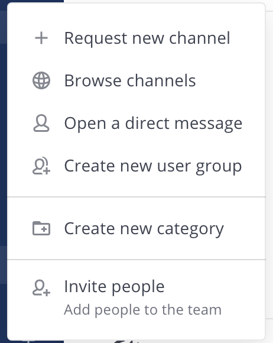
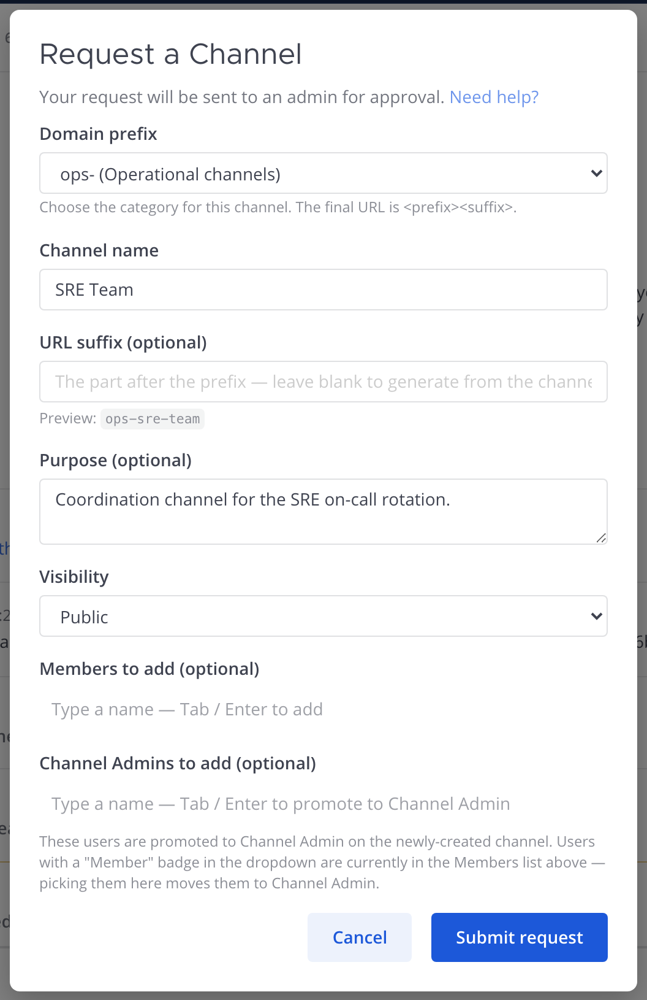
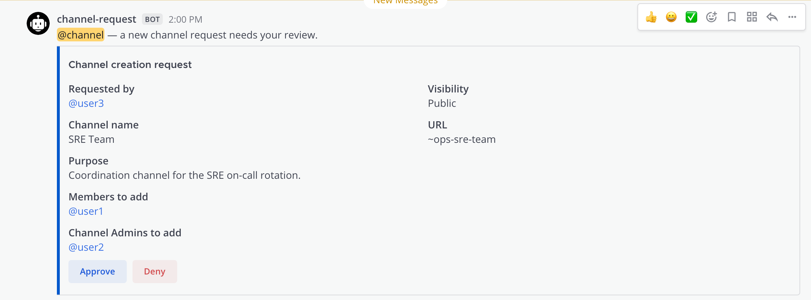
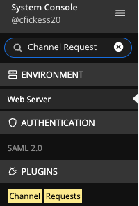
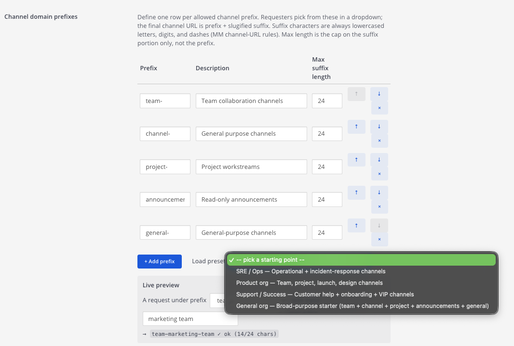

# Channel Requests — User Guide

The Channel Requests plugin lets members **request** a new channel instead of
creating one directly. The request goes to an approver; on approval the channel
is created, the requested members and Channel Admins are added, and everyone
added gets an @-mention welcome message.

> This is the companion to the [Channel Admin Requests guide](CHANNEL_ADMIN_GUIDE.md).
> *That* guide is about requesting **admin rights on an existing** channel; *this*
> one is about requesting a **brand-new** channel.

This guide covers three roles:

- [Requesting a channel](#requesting-a-channel) — any member
- [Approving requests](#approving-requests) — approvers
- [Admin setup](#admin-setup) — system admins

---

## Requesting a channel

There are a few ways to open the request form, and they all open the same
window.

### 1. From the "+" in the sidebar

Click the **+** at the top of the channel sidebar and choose **Request new
channel**. For members who can't create channels directly, Mattermost's native
"Create new channel" action is automatically relabeled to this.

### 2. From the channel header

Click the **Request Channel** icon in the channel header toolbar — same form as
the + menu.

### 3. From the slash command

Type `/channel-request` in any channel to open the request dialog.

### Filling out the request

| Field | What it does |
|-------|--------------|
| **Domain prefix** | Appears only if your admin configured prefixes. Pick the category — the final URL is `<prefix><suffix>`. |
| **Channel name** | The display name people see (e.g. *SRE Team*). Required. |
| **URL suffix / URL name** | Optional. Leave blank to auto-generate from the channel name. A live **Preview** shows the final URL (e.g. `ops-sre-team`). |
| **Purpose** | Optional short description of the channel. |
| **Visibility** | **Public** (anyone can join) or **Private** (invite only). |
| **Members to add** | Search and add users who become regular members on approval. |
| **Channel Admins to add** | Search and add users who become Channel Admins on approval. |

**Members vs Channel Admins:** a user can be in only one of the two lists. If you
add someone to Channel Admins who's already a Member (or vice versa), they
**move** to the new list automatically — a badge in the dropdown shows where a
user is currently assigned.

Click **Submit request**. You'll see a confirmation, and you'll get a direct
message when an approver responds.

---

## Approving requests

Approvers (System Admins, plus Team Admins if your admin enabled it) receive each
request in the **approval channel** with **Approve** and **Deny** buttons.

- **Approve** — creates the channel, adds the requested members, promotes the
  Channel Admins, and posts a welcome message that @-mentions everyone added.
- **Deny** — the request is closed and the requester is notified by DM.

Requests from users on the **auto-approve list** (and from System Admins) skip
this step — the channel is created immediately.

---

## Admin setup

Configure the plugin in **System Console → Plugins → Channel Requests** (search
"Channel Requests" to jump straight to it).

| Setting | Purpose |
|---------|---------|
| **Approval team** | The team whose channel receives requests. Required. |
| **Approval channel** | The channel where Approve/Deny cards are posted. Required. |
| **Channel domain prefixes** | The prefix list requesters pick from (see below). Leave empty for free-form URLs. |
| **Team Admins can approve requests** | When on, Team Admins of the approval team can approve/deny, not just System Admins. |
| **Auto-approve requests from these users** | Requests from these users skip approval. |
| **Audit channel ID** | Optional. Posts an audit line for every approve/deny. |

> To fully funnel non-admins through the request flow, remove the built-in
> **Create Public/Private Channel** permission from the System User role (System
> Console → User Management → Permissions). Mattermost's plugin API can't veto
> native channel creation.

### Domain prefixes

Each prefix is one row with a **prefix**, a **description**, and a **max suffix
length** (2–32 characters, capping the suffix only — not the prefix). A fresh
install starts empty:

Use **Load preset** to populate the table with a starter pack — **SRE / Ops**,
**Product org**, **Support / Success**, or **General org**. Loading a preset
updates prefixes you already have (description + max length) and appends any that
are missing. The **Live preview** at the bottom shows exactly what URL a request
will produce for a given prefix and typed suffix.

