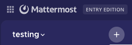
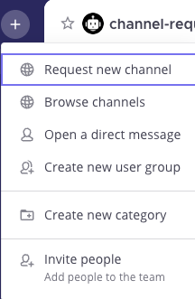
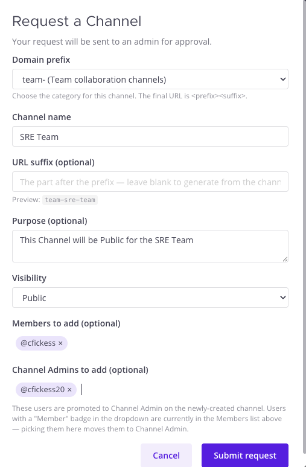
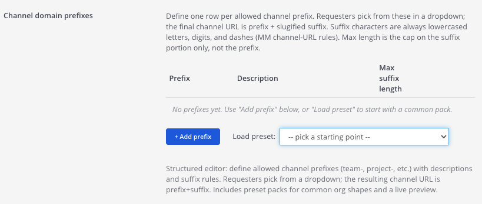

# Channel Requests — User Guide

The Channel Requests plugin lets members **request** a new channel instead of
creating one directly. Requests go to an approver, who approves or denies them.
On approval the channel is created, members and channel admins are added, and
everyone added gets an @-mention welcome message.

This guide covers three roles:

- [Requesting a channel](#requesting-a-channel) — anyone
- [Approving requests](#approving-requests) — approvers
- [Admin setup](#admin-setup) — system admins

---

## Requesting a channel

There are two ways to open the request form. Both open the same window.

### 1. From the "+" in the sidebar

Click the **+** at the top of the channel sidebar.

Then choose **Request new channel** from the menu. For members who can't create
channels directly, the native "Create new channel" action is automatically
relabeled to this.

### 2. From the channel header

Click the **Request Channel** icon in the channel header toolbar. (Same form as
the + menu — use whichever is handier.)

### Filling out the request

| Field | What it does |
|-------|--------------|
| **Domain prefix** | Appears only if your admin configured prefixes. Pick the category — the final URL is `<prefix><suffix>`. |
| **Channel name** | The display name people see (e.g. *SRE Team*). |
| **URL suffix** | Optional. The part after the prefix. Leave blank to auto-generate from the channel name. A live **Preview** shows the final URL (e.g. `team-sre-team`). |
| **Purpose** | Optional short description of the channel. |
| **Visibility** | **Public** (anyone can join) or **Private** (invite only). |
| **Members to add** | Search and add users who become regular members on approval. |
| **Channel Admins to add** | Search and add users who become channel admins on approval. |

**Members vs Channel Admins:** a user can be in only one of the two lists (see
the two chips in the form above). If you add someone to Channel Admins who's
already a Member (or vice versa), they **move** to the new list automatically —
a badge in the dropdown shows where a user is currently assigned.

Click **Submit request**. You'll see a confirmation and get a direct message when
an approver responds.

<!-- Screenshot pending: submission confirmation message (images/request-submitted.png) -->

---

## Approving requests

Approvers (System Admins, plus Team Admins if your admin enabled it) receive
each request in the **approval channel** with **Approve** and **Deny** buttons.

<!-- Screenshot pending: an approval request card with Approve/Deny buttons (images/approval-card.png) -->

- **Approve** — creates the channel, adds the requested members, promotes the
  channel admins, and posts a welcome message that @-mentions everyone added.
- **Deny** — the request is closed and the requester is notified by DM.

<!-- Screenshot pending: the welcome message mentioning added users (images/welcome-message.png) -->

Requests from users on the **auto-approve list** (and from System Admins) skip
this step — the channel is created immediately.

---

## Admin setup

Configure the plugin in **System Console → Plugins → Channel Requests** (search
"Channel Requests" to jump straight to it).

| Setting | Purpose |
|---------|---------|
| **Approval team** | The team whose channel receives requests. Required. |
| **Approval channel** | The channel where Approve/Deny cards are posted. Required. |
| **Channel domain prefixes** | The prefix list requesters pick from (see below). Leave empty for free-form URLs. |
| **Team Admins can approve requests** | When on, Team Admins of the approval team can approve/deny, not just System Admins. |
| **Auto-approve requests from these users** | Requests from these users skip approval. |
| **Audit channel ID** | Optional. Posts an audit line for every approve/deny. |

### Domain prefixes

Each prefix is one row with a **prefix**, a **description**, and a **max suffix
length** (2–32 characters, capping the suffix only — not the prefix). A fresh
install starts empty:

Use **Load preset** to populate the table with a starter pack — **SRE / Ops**,
**Product org**, **Support / Success**, or **General org**. Loading a preset
updates prefixes you already have (description + max length) and appends any that
are missing. The **Live preview** at the bottom shows exactly what URL a request
will produce for a given prefix and typed suffix.

